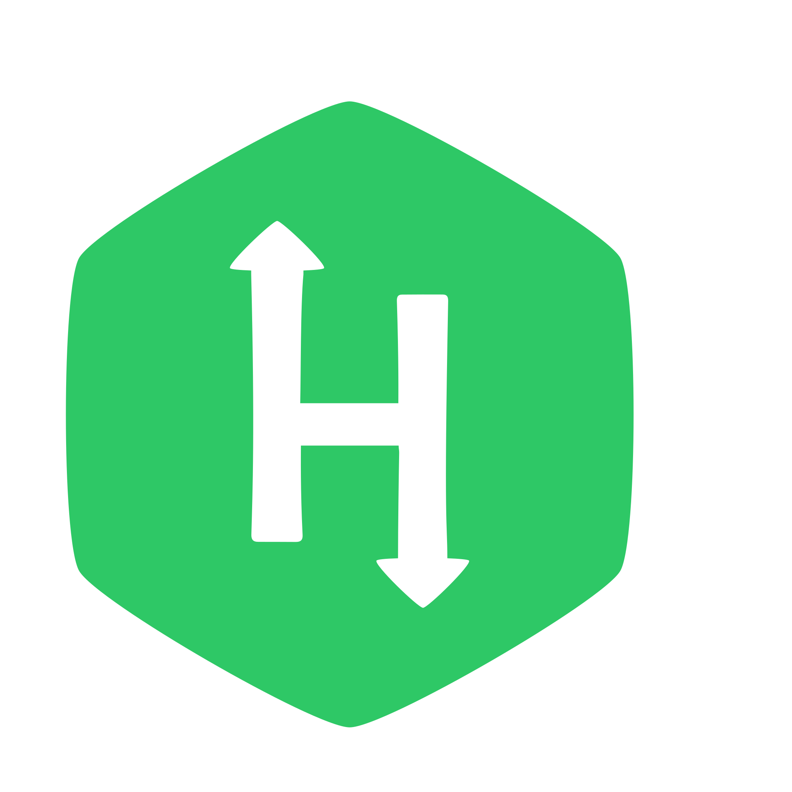

## Hi, Everyone!! 😃  

### 👋 I’m Edisson Prieto, a Systems and Computer Engineer from the Universidad Nacional de Colombia, with Great motivation to continue acquiring skills and grow professionally. I am fully confident in my ability to design and produce technological solutions for the company.
 

- 👀 I’m interested in Software Engineering, Software Architecture, DevOps, Data Analysis as well as web and mobile development. 
- 🌱 I’m currently learning Flutter, Go and enhancing my cloud knowledge.
- 🔥 I've worked with languages like Java, Python, C++, JavaScript and Elixir, I have also worked with frameworks such as Vue.js, Spring Boot.
- 💞️ I’m looking to collaborate on open software projects to gain hands-on experience.
- 📫 How to reach me: Take a look at my [LinkedIn](https://www.linkedin.com/in/edisson-david-vargas-712175129/), or email me at edprietov@unal.edu.co.
 

<!---
Edprietov/Edprietov is a ✨ special ✨ repository because its `README.md` (this file) appears on your GitHub profile.
You can click the Preview link to take a look at your changes.
--->

  
  **<h4 align="center">See you! 🙇</h4>**
   
   
  

  

 

  
   
   
  

